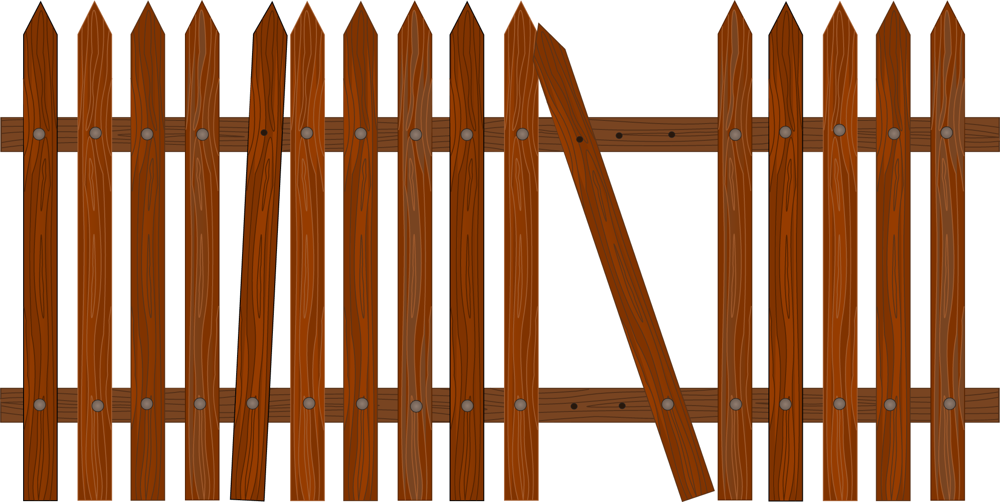

<p align="center">
  
</p>

# aiofence

[](https://codecov.io/gh/stanislaushimovolos/aiofence)

Multi-reason cancellation contexts for Python asyncio. Inspired by Go's `context.Context`, aiofence provides a cancellation context that propagates hierarchically through your application via `ContextVar` — no need to thread events, flags, or tokens through every call signature. Declare cancellation sources once at the boundary — inner code just wraps cancellable work in a context manager and doesn't care about the actual reasons, though it can inspect them if needed.

## Motivation

asyncio can cancel tasks mechanically — `task.cancel()`, `asyncio.timeout()` — but it can't tell you *why* you were cancelled or let you control *when*. Your task is abruptly killed at the next `await`, whether it's ready or not. When multiple cancellation sources exist (timeout, client disconnect, graceful shutdown), user code is forced to propagate events and flags through every call signature, spawn background listeners that watch for signals and cancel your task, and shield cleanup code so that a second cancel request doesn't kill the task mid-cleanup. Without a single centralized object that owns all of this, it gets messy fast:

```python
async def handle_request(request, shutdown_event, timeout=30):
    try:
        async with asyncio.timeout(timeout):
            while not shutdown_event.is_set():
                chunk = await get_next_chunk()
                if request.is_disconnected():
                    break
                await process(chunk)
    except TimeoutError:
        ...
    except asyncio.CancelledError:
        # shutdown? disconnect? something else?
        ...
```
For a deeper dive into the problem and design rationale, see [this Medium post](https://medium.com/p/8cdf8c5d519e).

`aiofence` solves this. Declare all cancellation sources once, composably. The callee doesn't even know cancellation exists:

```python
with (
    on_timeout(30)
    .event(shutdown, code="shutdown")
    .move_on_cancel()
) as fence:
    result = await fetch_and_transform()

if not fence.cancelled:
    await save(result)
else:
    print(fence.reasons)              # (CancelReason(message='timed out after 30s', ...),)
    print(fence.cancelled_by("shutdown"))  # True / False
```

Or raise instead of inspect:

```python
with on_timeout(30).raise_on_cancel() as fence:
    result = await fetch_and_transform()
# raises FenceCancelled if timed out
```

### What about `asyncio.shield()`?

`shield()` prevents cancellation from reaching shielded code, but it works from the opposite direction — you protect everything that *must not* be cancelled. In practice this means wrapping database writes, state transitions, logging, and cleanup individually, and each function needs to know whether it's cancel-safe.

aiofence comes at it differently: most code doesn't know cancellation exists. You only wrap the expensive, safely-interruptible parts — the operations you *want* to cancel. For example, in an LLM inference service, you don't want to cancel database queries or response formatting. You want to cancel the LLM call that's burning GPU time for a client that already disconnected:

```python
with (
    on_event(client_disconnect)
    .timeout(budget)
    .move_on_cancel()
) as fence:
    result = await llm.generate(prompt)  # cancellable

await db.save(result or fallback)  # always runs, no shield needed
```

### Why not anyio?

anyio is one of the best async libraries in the Python ecosystem, and its `CancelScope` is a more powerful and general cancellation model than what asyncio provides natively. aiofence is narrower in scope and makes different trade-offs:

1. **Drop-in for existing asyncio code.** anyio introduces its own cancellation semantics (`CancelScope`, level-triggered cancellation, nested scope trees). If your app is already built on pure asyncio, adopting anyio's model is a significant migration. aiofence works directly with asyncio's `cancel()`/`uncancel()` counter protocol — no new runtime, no new cancellation model.

2. **Different design philosophy.** anyio's approach is a broad `CancelScope` over the whole operation, with `CancelScope(shield=True)` around the parts that must survive. aiofence takes the inverse: most code runs unaware of cancellation, and you wrap only the expensive, safely-interruptible parts with a `Fence`.

## Features

**Composable triggers** — chain timeouts, events, deadlines, and custom triggers into a single `Fencing`. Each call returns a new immutable builder, so configs are safe to share and extend:

```python
fencing = on_timeout(30, code="budget").event(shutdown, code="shutdown")

# extend per-operation
with fencing.timeout(5, code="db").move_on_cancel() as fence:
    await query_db()
```

**Context propagation** — store a `Fencing` in a `ContextVar` at the boundary, read it anywhere with `Fencing.current()`. No need to pass configs through every call signature:

```python
# HTTP handler boundary
with bind_fencing(on_event(disconnect, code="disconnect").timeout(30)):
    await handle_request()

# deep inside, no arguments needed
async def process():
    with Fencing.current().move_on_cancel() as fence:
        await do_work()
```

**Typed cancellation reasons** — after cancellation, inspect *which* trigger fired. Each reason carries a machine-readable `code` for programmatic matching:

```python
if fence.cancelled_by("disconnect"):
    log("client left")
elif fence.cancelled_by("budget"):
    return cached_result
```

**Native asyncio** — works with asyncio's `cancel()`/`uncancel()` counter protocol. Compatible with `TaskGroup`, `asyncio.timeout()`. No new runtime, no dependencies.

## Starlette / FastAPI

`disconnect_fencing` binds a client-disconnect trigger to the current `Fencing` context via `bind_fencing()`. When the client disconnects, any active `Fence` — anywhere in the call stack — is cancelled with `code="disconnect"`:

```python
from aiofence.contrib.starlette import disconnect_fencing

@app.get("/work")
async def handler(fencing: Fencing = Depends(disconnect_fencing)):
    with fencing.timeout(30, code="budget").move_on_cancel() as fence:
        await long_work()

    if fence.cancelled_by("disconnect"):
        return Response(status_code=499)
```

The real value is that `disconnect_fencing` calls `bind_fencing()` internally, so service-layer code doesn't need to know about HTTP, requests, or disconnect events — it reads the cancellation context via `Fencing.current()`:

```python
# handler — declares cancellation sources at the boundary
@app.get("/generate")
async def handler(
    prompt: str,
    fencing: Fencing = Depends(disconnect_fencing),
):
    result = await generate_response(prompt)
    return {"status": "ok", "result": result}

# service layer — no request, no fencing in the signature
async def generate_response(prompt: str) -> str:
    with (
        Fencing.current()
        .timeout(30, code="budget")
        .move_on_cancel()
    ) as fence:
        result = await llm.generate(prompt)

    if fence.cancelled_by("disconnect"):
        return "client disconnected, skipping"
    if fence.cancelled_by("budget"):
        return await get_cached_response(prompt)
    return result
```

Requires `starlette` (installed with FastAPI). No additional dependencies.

## Documentation

- [API Guide](docs/api.md) — usage, patterns, and examples
- [Architecture](docs/architecture.md) — how it works, cancellation flow, design decisions
- [Why Suppress](docs/why-suppress.md) — why `CancelledError` is suppressed instead of raised
- [CPython Task Cancellation](docs/cpython-task-cancellation.md) — how `asyncio.Task` cancellation works under the hood

## Caveats

**Nested Fences are not supported.** Entering a `Fence` while another is active on the same task raises `RuntimeError`. Use sequential fences or `Fencing.current()` composition instead. See [#12](https://github.com/stanislaushimovolos/aiofence/issues/12) for details and progress.

## Requirements

Python 3.12+. No dependencies.

## License

MIT
